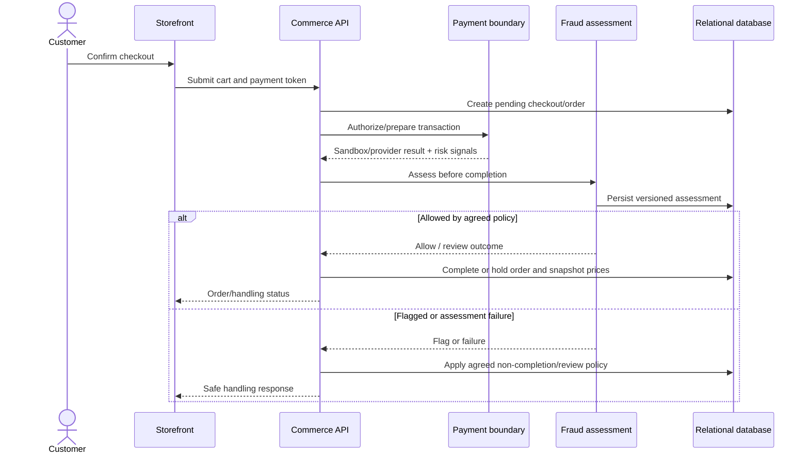
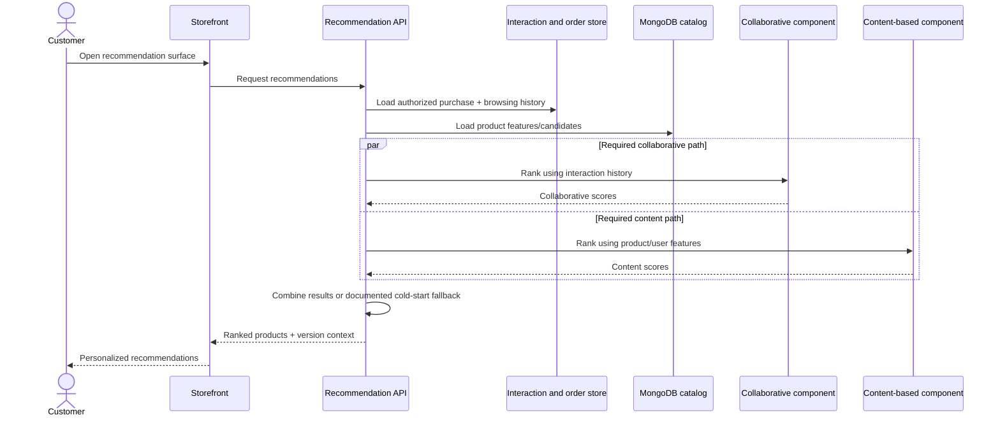
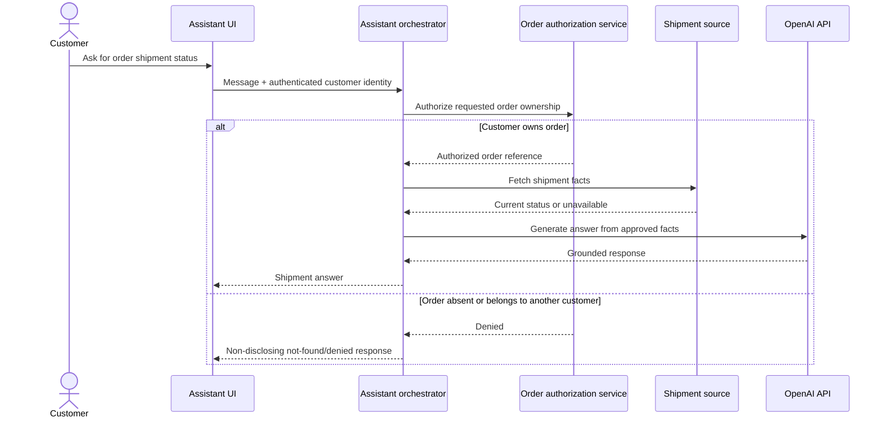

# UML Sequence Views

## Checkout with fraud assessment before completion

```mermaid
sequenceDiagram
    actor Customer
    participant UI as Storefront
    participant API as Commerce API
    participant Pay as Payment boundary
    participant Risk as Fraud assessment
    participant DB as Relational database

    Customer->>UI: Confirm checkout
    UI->>API: Submit cart and payment token
    API->>DB: Create pending checkout/order
    API->>Pay: Authorize/prepare transaction
    Pay-->>API: Sandbox/provider result + risk signals
    API->>Risk: Assess before completion
    Risk->>DB: Persist versioned assessment
    alt Allowed by agreed policy
        Risk-->>API: Allow / review outcome
        API->>DB: Complete or hold order and snapshot prices
        API-->>UI: Order/handling status
    else Flagged or assessment failure
        Risk-->>API: Flag or failure
        API->>DB: Apply agreed non-completion/review policy
        API-->>UI: Safe handling response
    end
```

## Personalized recommendation request

```mermaid
sequenceDiagram
    actor Customer
    participant UI as Storefront
    participant API as Recommendation API
    participant Ops as Interaction and order store
    participant Cat as MongoDB catalog
    participant CF as Collaborative component
    participant CBF as Content-based component

    Customer->>UI: Open recommendation surface
    UI->>API: Request recommendations
    API->>Ops: Load authorized purchase + browsing history
    API->>Cat: Load product features/candidates
    par Required collaborative path
        API->>CF: Rank using interaction history
        CF-->>API: Collaborative scores
    and Required content path
        API->>CBF: Rank using product/user features
        CBF-->>API: Content scores
    end
    API->>API: Combine results or documented cold-start fallback
    API-->>UI: Ranked products + version context
    UI-->>Customer: Personalized recommendations
```

## Authorized shipment lookup through the assistant

```mermaid
sequenceDiagram
    actor Customer
    participant UI as Assistant UI
    participant API as Assistant orchestrator
    participant Orders as Order authorization service
    participant Ship as Shipment source
    participant LLM as OpenAI API

    Customer->>UI: Ask for order shipment status
    UI->>API: Message + authenticated customer identity
    API->>Orders: Authorize requested order ownership
    alt Customer owns order
        Orders-->>API: Authorized order reference
        API->>Ship: Fetch shipment facts
        Ship-->>API: Current status or unavailable
        API->>LLM: Generate answer from approved facts
        LLM-->>API: Grounded response
        API-->>UI: Shipment answer
    else Order absent or belongs to another customer
        Orders-->>API: Denied
        API-->>UI: Non-disclosing not-found/denied response
    end
```
